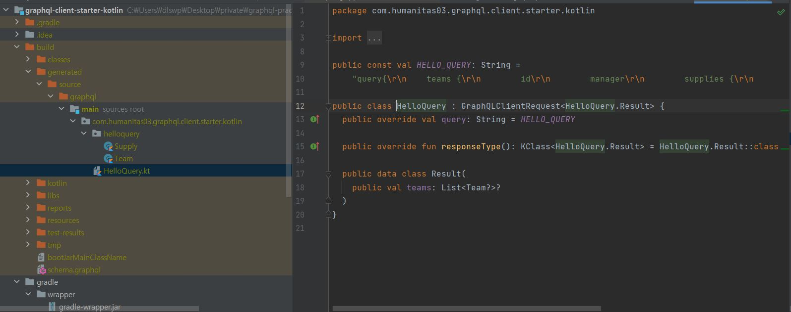
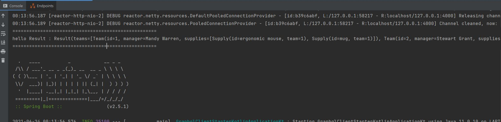

#### ExpediaGroup GraphQL Kotlin(5.0.0-Alpha)
* 공식 Docs : https://expediagroup.github.io/graphql-kotlin/docs/
* 참고문서
 * https://medium.com/expedia-group-tech/introducing-graphql-kotlin-client-b32dc3061a6f

```text
When creating GraphQL queries make sure to always specify an operation name and name the files accordingly. 
Each one of your query files will generate a corresponding Kotlin file 
with a class matching your operation name that will act as a wrapper for all corresponding data classes.
```

* 스키마가 아니라 Query.grqphql을 filePath에 지정해줘야 gradle build시 Query class가 Generation 됩니다.

* src/resouces/kotlin-graphql에 "***.graphql"로 쿼리를 올려 놓아 주세요.
```graphql
query{
    teams {
        id
        manager
        supplies {
            id
            team
        }
    }
}
```

* build.gradle
```groovy
plugins {

    id("org.springframework.boot") version "2.5.1"
    id("io.spring.dependency-management") version "1.0.11.RELEASE"
    kotlin("jvm") version "1.5.10"
    kotlin("plugin.spring") version "1.5.10"

    id("com.expediagroup.graphql") version "5.0.0-alpha.0"
}

graphql {
    client {
        endpoint = "http://localhost:4000/"
        packageName = "com.humanitas03.graphql.client.starter.kotlin"
        queryFileDirectory = "$projectDir/src/main/resources/kotlin-graphql"
    }
}

dependencies {
    implementation("com.expediagroup:graphql-kotlin-spring-client:5.0.0-alpha.0")
}

```

* gradle build 시  build/generated 하위에 쿼리 클래스들이 생성됩니다.
  
  


* 그냥 컨트롤러 없이 Main이 뜨면서 결과를 확인하고자 하였습니다.
```kotlin

@SpringBootApplication
class GraphqlClientStarterKotlinApplication

fun main(args: Array<String>) {
    runApplication<GraphqlClientStarterKotlinApplication>(*args) {
        println("=========start")
        runBlocking {
            val graphQLClient = GraphQLWebClient("http://localhost:4000/graph")
            val result = graphQLClient.execute(HelloQuery())
            println("====================================================")
            println("hello Result : ${result.data}")
            println("====================================================")
        }
    }
}

```


